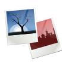

<picture class="full pixels">
    
</picture>

# Shotwell

Shotwell is an easy-to-use, fast photo organizer.
It allows you to import photos from your camera or disk, organize them by date and subject
matter, even ratings.  It also offers basic photo editing, like crop, red-eye correction,
color adjustments, and straighten.  Shotwell’s non-destructive photo editor does not alter
your master photos, making it easy to experiment and correct errors.

When ready, Shotwell can upload your photos to various web services, such as Flickr,
Google Photos, and more.

Shotwell supports JPEG, PNG, HEIF/HEIC, AVIF, TIFF, WebP, JpegXL, GIF, and a variety of RAW file formats.

## Features

* Import from disk or camera
* Organize by time-based Events, Tags (keywords), Folders, and more
* View your photos in full-window or fullscreen mode
* Crop, rotate, color adjust, straighten, and enhance photos
* Slideshow
* Video and RAW photo support
* Share to major Web services, including Flickr, Tumblr and YouTube 

<picture class="full pixels">
  
</picture>

## Installation

Shotwell is available through your distribution's package manger or [directly on Flathub](https://flathub.org/apps/details/org.gnome.Shotwell)

## Links

* [Old GNOME Wiki page](https://wiki.gnome.org/Apps/Shotwell)
* [Shotwell source code repository](https://gitlab.gnome.org/GNOME/shotwell)
* [User Manual](https://shotwell-project.org/doc/html/)
* [Online services privacy policy](https://shotwell-project.org/doc/html/privacy-policy.html)
